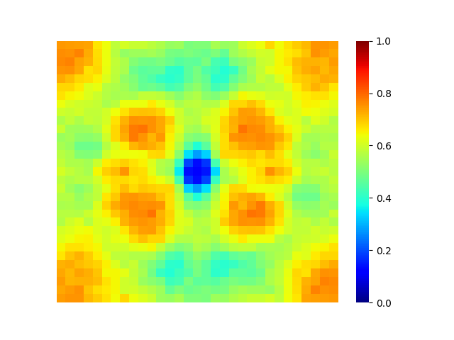

# FourierHeatmap

This is an unofficial pytorch implementation of Fourier Heat Map which is prosed in the paper, [A Fourier Perspective on Model Robustness in Computer Vision [Yin+, NeurIPS2019]](https://arxiv.org/abs/1906.08988). 

Fourier Heat Map allows to investigate the sensitivity of CNNs to high and low frequency corruptions via a perturbation analysis in the Fourier domain.

## Requirements

You will need the following to run the codes:
- Python 3.7+
- PyTorch 1.4+
- TorchVision
- numpy
- click
- tqdm
- matplotlib
- seaborn

Note that I run the code with Ubuntu 18, Pytorch 1.4.0, CUDA 10.1.

## Usage

### Generating Fourier base function

The script `fhmap/fourier_base.py`
generates Fourier base function based on given indeces; `(i,j)`. 
Example code:

```
cd fhmap
python fourier_base.py
```

will generate 32x32 types 2D Fourier basis and save as an image under `logs/fourier_base_32x32.png`. The generated image should be like follows. 

### Evaluating Fourier Heat Map

The script `apps/eval.py`
eveluate Fourier Heat Map for a model. For example:

```
cd apps
python eval.py -a resnet56 -w [WEIGHT_PATH]  -d cifar10 --h_map_size 31 --w_map_size 31 -k 1 -l [LOG_DIR] --eps 32
```

will generate 31x31 Fourier Heat Map for ResNet56 on Cifar-10 dataset and save as an image under `LOG_DIR/fhmap.png`. The generated image should be like follows. 




Note that currectly both `h_map_size` and `w_map_size`  should be odd number because of the symetry of Fourier basis.

## References

- [Dong Yin, Raphael Gontijo Lopes, Jonathon Shlens, Ekin D. Cubuk, Justin Gilmer. "A Fourier Perspective on Model Robustness in Computer Vision.", in NeurIPS, 2019.](https://arxiv.org/abs/1906.08988)
- [Justin Gilmer and Dan Hendrycks. "Adversarial Example Researchers Need to Expand What is Meant by ‘Robustness’.", in Distill, 2019.](https://distill.pub/2019/advex-bugs-discussion/response-1/)