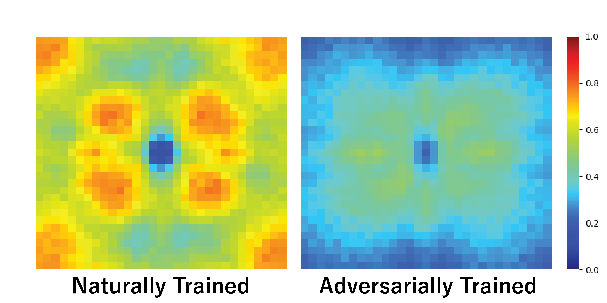
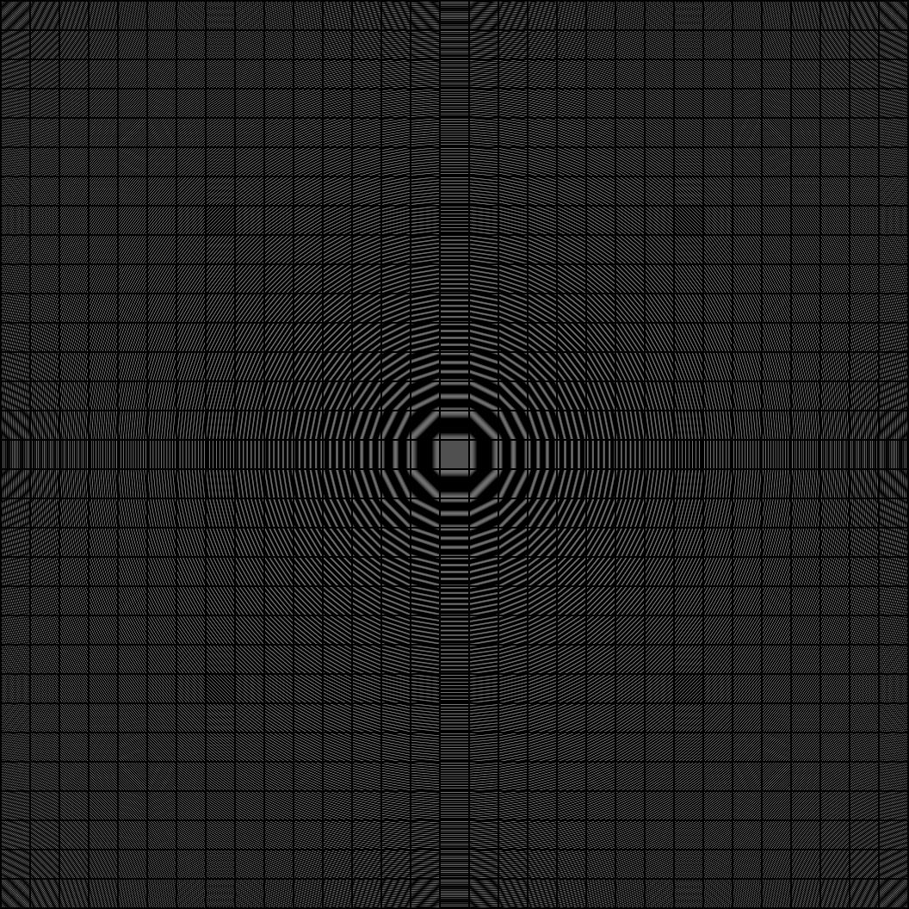

# FourierHeatmap (latest release: v0.2.0)

[](https://github.com/gatheluck/FourierHeatmap/actions?query=workflow%3ACI)
[](https://codecov.io/gh/gatheluck/FourierHeatmap)
[](LICENSE)

This is an unofficial pytorch implementation of Fourier Heat Map which is proposed in the paper, [A Fourier Perspective on Model Robustness in Computer Vision [Yin+, NeurIPS2019]](https://arxiv.org/abs/1906.08988). 

Fourier Heat Map allows to investigate the sensitivity of CNNs to high and low frequency corruptions via a perturbation analysis in the Fourier domain.



## News
We release v0.2.0. API is renewed and some useful libraries (e.g. [hydra](https://hydra.cc/docs/intro/)) are added.

Previous version is still available as [v0.1.0](https://github.com/gatheluck/FourierHeatmap/tree/v0.1.0).

## Requirements
This library requires following as a pre-requisite.
- python 3.9+
- poetry

Note that I run the code with Ubuntu 20, Pytorch 1.8.1, CUDA 11.0.

## Installation
This repo uses [poetry](https://python-poetry.org/) as a package manager. 
The following code will install all necessary libraries under `.venv/`.

```
git clone git@github.com:gatheluck/FourierHeatmap.git
cd FourierHeatmap
pip install poetry  # If you haven't installed poetry yet.
poetry install
```

## Setup

### Dataset

This codes expect datasets exist under `data/`. For example, if you want to evaluate Fourier Heat Map for ImageNet, please set up like follows:

```
FourierHeatmap
├── data
│	└── imagenet
│		├── train/
│		└── val/
```

## Usage

### Visualizing Fourier basis

The script `fhmap/fourier/basis.py` generates Fourier base functions. For example:

```
poetry run python fhmap/fourier/basis.py
```

will generate 31x31 2D Fourier basis and save as an image under `outputs/basis.png`. The generated image should be like follows. 



### Evaluating Fourier Heat Map

The script `fhmap/apps/eval_fhmap.py`
eveluate Fourier Heat Map for a model. For example:

```
poetry run python fhmap/apps/eval_fhmap.py dataset=cifar10 arch=resnet56 weightpath=[PYTORCH_MODEL_WEIGHT_PATH] eps=4.0
```

will generate 31x31 Fourier Heat Map for ResNet56 on CIFAR-10 dataset and save as an image under `outputs/eval_fhmap/`. The generated image should be like follows. 


Note that the L2 norm size (=eps) of Fourier basis use in original paper is following:
| dataset | eps
---- | ----
| CIFAR-10 | 4.0
| ImageNet | 15.7

## Evaluating custom dataset and model


### Evaluating your custom dataset 

If you want to evaluate Fourier Heat Map on your custom dataset, please refer follwing instraction.

- Implement `YourCustomDatasetStats` class: 
	- This class holds basic dataset information.
	- `YourCustomDatasetStats` class should inherit from original `DatasetStats` class in `factory/dataset` module and also shoud be placed in `factory/dataset` module. 
	- For details, please refer to the `Cifar10Stats` class in `factory/dataset` module.

- Implement `YourCustomDataModule` class:
	- This class is responsible for preprocess, transform (includes adding Fourier Noise to image) and create test dataset.
	- `YourCustomDataModule` class should inherit from `BaseDataModule` class in `factory/dataset` module and also shoud be placed in `factory/dataset` module. 
	- For details, please refer to the `Cifar10DataModule` class in `factory/dataset` module.

- Implement `YourCustomDatasetConfig` class:
	- This class is needed for applying [hydra](https://hydra.cc/)'s [dynamic object instantiation](https://hydra.cc/docs/patterns/instantiate_objects/overview) to dataset class.
	- `YourCustomDatasetConfig` class should inherit from `DatasetConfig` class in `schema/dataset` module and also shoud be placed in `schema/dataset` module. Please add `YourCustomDatasetConfig` to `schema/__init__`.
	- For details, please refer to the `Cifar10Config` class in `schema/dataset` module.

- Add option for your custom dataset:
	- Lastly, please add the config of your custom dataset to `ConfigStore` class by adding a follwing line to `apps/eval_fhmap`.

	```
	cs.store(group="dataset", name="yourcustomdataset", node=schema.YourCustomDatasetConfig)
	```

Now, you will be able to call your custom dataset like following.

```
poetry run python fhmap/apps/eval_fhmap.py dataset=yourcustomdataset arch=resnet50 weightpath=[PYTORCH_MODEL_WEIGHT_PATH] eps=4.0
```

### Evaluating your custom architecture (model)

If you want to evaluate Fourier Heat Map on your custom architecture (model), please refer follwing instraction.

- Implement `YourCustomArch` class:
	- Please implement class or function which return your custom architecture. The custom architecture have to subclass of `torch.nn.module`.
	- For details, please refer to the `factory/archs/resnet` module.

- Implement `YourCustomArchConfig` class:
	- This class is needed for applying [hydra](https://hydra.cc/)'s [dynamic object instantiation](https://hydra.cc/docs/patterns/instantiate_objects/overview) to architecture class.
	- `YourCustomArchConfig` class should inherit from `ArchConfig` class in `schema/arch` module and also shoud be placed in `schema/arch` module. Please add `YourCustomArchConfig` to `schema/__init__`.
	- For details, please refer to the `Resnet56Config` class in `schema/arch` module.
	- If you want to use architectures which is provided by other libs like [pytorch](https://github.com/pytorch/pytorch) or [timm](https://github.com/rwightman/pytorch-image-models), please refere to the `Resnet50Config` class in `schema/arch` module.

- Add option for your custom architecture:
	- Lastly, please add the config of your custom architecture to `ConfigStore` class by adding a follwing line to `apps/eval_fhmap`.

	```
	cs.store(group="arch", name="yourcustomarch", node=schema.YourCustomArchConfig)
	```

Now, you will be able to call your custom arch like following.

```
poetry run python fhmap/apps/eval_fhmap.py dataset=cifar10 arch=yourcustomarch weightpath=[PYTORCH_MODEL_WEIGHT_PATH] eps=4.0
```

## References

- [Dong Yin, Raphael Gontijo Lopes, Jonathon Shlens, Ekin D. Cubuk, Justin Gilmer. "A Fourier Perspective on Model Robustness in Computer Vision.", in NeurIPS, 2019.](https://arxiv.org/abs/1906.08988)
- [Justin Gilmer and Dan Hendrycks. "Adversarial Example Researchers Need to Expand What is Meant by ‘Robustness’.", in Distill, 2019.](https://distill.pub/2019/advex-bugs-discussion/response-1/)